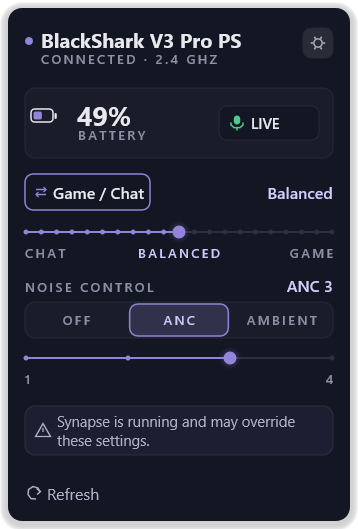
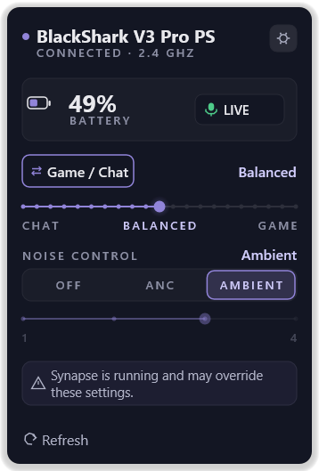

# windows-headset-control

Control your Razer BlackShark V3 Pro headset from the Windows tray, without running Synapse.



Battery, microphone mute, sidetone, game/chat balance, and noise cancellation — in a panel
that opens from the notification area and closes when you click away. It uses around 30 MB
of memory and starts with Windows if you let it.

- Runs as a normal user. No administrator rights.
- Installs no driver and no service.
- Never touches firmware.
- No network access and no telemetry, ever.

## Will it work with my headset?

**One model, and only one:**

| | |
| --- | --- |
| Product | Razer BlackShark V3 Pro (wireless, via its USB dongle) |
| USB vendor id | `0x1532` |
| USB product id | `0x101B` |

Other products **are not supported**, including other BlackShark models. This talks to the
headset in a language worked out by watching it, not from documentation, so a different
product id is a different device until somebody does that work again.

Not sure what you have? Install it and run `headsetctl list --vendor-id 0x1532`. If that
prints nothing, this can't talk to your headset.

## Install

**[Download the latest release](https://github.com/cunningorb/windows-headset-control/releases/latest)**
and run the setup executable. It installs for you only, adds a Start menu entry, and offers
to start with Windows.

**Windows will warn you.** The installer isn't code-signed, so SmartScreen shows "Windows
protected your PC". Choose **More info**, then **Run anyway**.

To remove it: Settings → Installed apps → Headset Tray → Uninstall.

## Using it

Click the tray icon to open the panel.

**Battery and microphone** are shown at the top. The mic reads `MUTED` if *either* the
headset's own switch or Windows is muting you, because either one silences you — clicking
it toggles the Windows side, since no software can move a physical switch.

**Sidetone** (0–15) is how much of your own voice you hear. **Game/chat balance** (0–20)
mixes the two audio channels the headset presents. The button switches which one the slider
drives; drag it and let go, and the change is sent once.

**Noise control** is off, ANC, or ambient.



ANC has four levels. Ambient has none — so the level track goes quiet in that mode, but
keeps showing where ANC will land when you switch back, because the headset remembers.

**Nothing on screen is a guess.** A value the headset refuses shows as `--`, never as a
number. Losing the wireless link clears the readings rather than leaving stale ones up. And
after every change, the tray asks the headset what it actually holds — so if it disagrees
with what you asked for, you see the truth.

Right-click the icon for Refresh and Exit. The gear opens settings: start with Windows, and
whether to warn you when Synapse is running (it can fight this app for the same settings).

The panel **follows your Windows light or dark setting** by default. **Appearance** in
settings overrides that — auto, dark, or light. If you use Windows high contrast, it wins
over all three.

## Good to know

It's **alpha**. It works on the author's hardware and is covered by a few hundred tests,
but it speaks a reconstructed protocol and has been used on exactly one headset.

It sends vendor-specific commands to hardware. It performs no firmware access of any kind,
and every command it can send was observed being sent by Razer's own software — but no
warranty is offered. Running it may void your hardware warranty.

Some things you might expect are **not** here, because they aren't the headset's to
control: volume and software mic mute are handled by Windows, and Synapse's audio
enhancements (bass boost, voice clarity, and so on) are processed on your PC by THX rather
than on the headset. There is nothing for this app to send.

## Command line

`headsetctl` ships alongside the tray. Every command takes `--json`, and
`--include-sensitive` to reveal device paths (redacted by default).

```
> headsetctl get battery
battery: 49
> headsetctl set sidetone 7
sidetone: 7
> headsetctl noise
noise-cancellation: anc level 4
> headsetctl noise --level 2        # keeps the current mode
noise-cancellation: anc level 2
> headsetctl noise --mode ambient   # ambient has no level; the ANC level is retained
noise-cancellation: ambient (anc level 2)
```

| Command | Writes to the device |
| --- | --- |
| `list`, `inspect`, `probe`, `watch` | no |
| `get <name>` | sends a read request |
| `set <name> <value>` | yes |
| `noise` | reads; writes only when given `--mode` or `--level` |
| `param get/set <id>` | yes, allowlisted identifiers only |

`get` reports `unavailable` rather than a number when the headset refuses a read — which is
what happens when it's switched off. `set` re-reads afterwards and tells you what the device
actually holds, because a write being acknowledged is not evidence it took effect.

`list` enumerates every HID collection on the machine and names the best control candidate.
`inspect` opens one with no I/O rights and prints its report descriptor. `probe` listens for
an unsolicited report without sending anything; silence is a normal result, since the device
only speaks when something changes.

```
> headsetctl param get 0x2c        # observed but unidentified; no meaning is claimed
0x2c: 0f
```

## How it works

The headset speaks a proprietary HID protocol with no public documentation. This project
worked it out by capturing Razer's own software driving the hardware, and
[`docs/device-research.md`](docs/device-research.md) records the evidence for every byte:
what was sent, what came back, under what conditions.

**The project can only send identifiers it has actually seen on the wire.** They live in
allowlists in `headset-protocol`, which cannot encode anything else — so a guessed or
brute-forced command has no path to your device from anywhere in the codebase. Ten observed
parameters whose meaning was never established stay deliberately unnamed rather than being
given plausible-sounding labels.

No code, comments, or command tables were taken from any other project.
[`docs/clean-room-notes.md`](docs/clean-room-notes.md) records what was consulted and on
what terms, including a hypothesis that turned out to be wrong.

Further reading: [`docs/architecture.md`](docs/architecture.md) for how the crates fit
together, [`docs/threat-model.md`](docs/threat-model.md) for the security posture, and
[`docs/history/`](docs/history/) for the design record.

## Building from source

Windows only, and the toolchain requirements are more specific than usual — see
[`CONTRIBUTING.md`](CONTRIBUTING.md) before you start.

```powershell
.\build-installer.ps1        # produces dist\HeadsetTray-<version>-setup.exe
```

Or put a build in place without packaging it:

```powershell
cargo build --release
.\target\release\headset-tray.exe --install
```

Contributions are welcome; [`CONTRIBUTING.md`](CONTRIBUTING.md) explains the rules that
keep the protocol work honest, and there are a few of them.

## Non-affiliation

This is an unofficial community interoperability utility. It is not affiliated with,
authorized by, endorsed by, or sponsored by Razer Inc. or any other manufacturer. Product
names are used only to describe hardware compatibility.

Razer, BlackShark, Synapse, and THX are trademarks of their respective owners. They are used
here only to identify the hardware this utility interoperates with. This project's licence
grants no rights in any trademark.

## Licence

Licensed under either of

- Apache License, Version 2.0 ([`LICENSE-APACHE`](LICENSE-APACHE) or
  <https://www.apache.org/licenses/LICENSE-2.0>)
- MIT licence ([`LICENSE-MIT`](LICENSE-MIT) or <https://opensource.org/licenses/MIT>)

at your option.

Unless you explicitly state otherwise, any contribution intentionally submitted for
inclusion in the work by you, as defined in the Apache-2.0 licence, shall be dual licensed
as above, without any additional terms or conditions.
